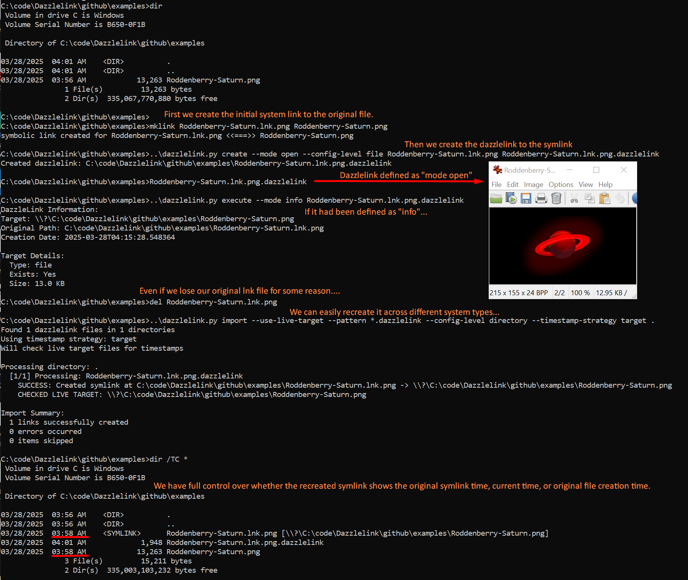

# Dazzlelink

> Preserve, manage, and understand symbolic links across different operating systems and environments.

Dazzlelink is a cross-platform tool that exports, imports, and manages symbolic links, with a particular focus on handling network paths and preserving links across different systems. It solves the common challenge of maintaining and backing-up symbolic links when moving between Windows, Linux, macOS, and BSD environments.



## Features

- **Export and Import**: Save symbolic links to portable `.dazzlelink` files and recreate them on any system
- **Cross-Platform Support**: Seamlessly handle symlinks between Windows, Linux, macOS, and BSD
- **UNC Path Handling**: Intelligently convert between UNC paths (`\\server\share`) and drive letters
- **Timestamp Preservation**: Maintain creation, modification, and access times when recreating symlinks
- **Batch Operations**: Process entire directories of symlinks with a single command
- **Flexible Configuration**: Global, directory, and file-level configuration options

## Use Cases

### 🔄 Cross-Platform Development

Maintain consistent development environments across different operating systems. Export symbolic links from your Windows machine and import them on your Linux development environment without losing critical references.

### 🖥️ System Administration

Simplify management of complex network shares and symbolic link structures. Document and reproduce symlink configurations for backup or disaster recovery scenarios.

### 📂 Content Organization

Create organizational structures using symbolic links, then export and share these structures with others. Perfect for media libraries, project references, or any scenario where files need to appear in multiple locations without duplication.

### 🔍 Network Path Management

Automatically convert between different representations of network paths (UNC paths, drive letters) across systems while maintaining all link metadata.

## Installation

### Prerequisites

- Python 3.6 or higher
- On Windows: pywin32 (optional, for enhanced Windows support)

### Install from PyPI

```bash
pip install dazzlelink
```

### Manual Installation

```bash
git clone https://github.com/dustinjd/dazzlelink.git
cd dazzlelink
pip install -e .
```

## Quick Start

### Export a symbolic link

```bash
# Export a single symlink to a .dazzlelink file
dazzlelink export path/to/symlink

# Export all symlinks in a directory
dazzlelink scan --recursive /path/to/directory
```

### Import a symbolic link

```bash
# Import (recreate) a symlink from a .dazzlelink file
dazzlelink import path/to/file.dazzlelink

# Import all dazzlelinks in a directory, preserving target timestamps
dazzlelink import -l --timestamp-strategy target /path/to/dazzlelinks
```

### Convert existing symlinks

```bash
# Convert all symlinks in a directory to dazzlelinks
dazzlelink convert /path/to/directory --recursive

# Mirror a directory structure using dazzlelinks
dazzlelink mirror /source/directory /destination/directory
```

## Command Reference

| Command | Description |
|---------|-------------|
| `create` | Create a new dazzlelink pointing to a target |
| `export` | Export a symlink to a .dazzlelink file |
| `import` | Import and recreate symlinks from dazzlelinks |
| `scan` | Scan for symlinks and report |
| `convert` | Convert all symlinks in directory to dazzlelinks |
| `mirror` | Mirror directory structure with dazzlelinks |
| `execute` | Execute/open the target of a dazzlelink |
| `check` | Check symlinks and report broken ones |
| `rebase` | Change link paths (relative/absolute conversion) |
| `config` | View or set configuration options |

## Common Options

| Option | Description |
|--------|-------------|
| `--recursive`, `-r` | Process subdirectories |
| `--timestamp-strategy` | Choose how to handle timestamps (`current`, `symlink`, `target`, `preserve-all`) |
| `--use-live-target`, `-l` | Check live target files for timestamps |
| `--output`, `-o` | Specify output path |
| `--executable`, `-e` | Make dazzlelinks executable |
| `--mode`, `-m` | Set execution mode (`info`, `open`, `auto`) |

## Advanced Usage

### Configuration Levels

Dazzlelink supports three levels of configuration:

1. **Global** (`~/.dazzlelinkrc.json`): System-wide default settings
2. **Directory** (`.dazzlelink_config.json`): Settings for a specific directory
3. **File**: Settings embedded in each dazzlelink file

### Network Path Handling

Dazzlelink automatically handles conversion between different network path formats:

```bash
# UNC paths are preserved and converted as needed
dazzlelink export "\\server\share\folder\file.txt"

# Mapped drive paths are converted to UNC when appropriate
dazzlelink export "Z:\folder\file.txt"
```

### Timestamp Strategies

Control how timestamps are preserved when recreating symlinks:

```bash
# Use timestamps from the original symlink
dazzlelink import --timestamp-strategy symlink file.dazzlelink

# Use timestamps from the target file
dazzlelink import --timestamp-strategy target file.dazzlelink

# Check the live target file for up-to-date timestamps
dazzlelink import -l --timestamp-strategy target file.dazzlelink
```

## Vision and Roadmap

Dazzlelink began as a tool for preserving symbolic links across platforms, but is evolving toward a more comprehensive vision of understanding and visualizing file relationships:

### 🔍 Content Relationship Discovery

Future versions aim to integrate with content similarity tools (like the companion tool "find-best-images") to identify and map relationships between files based on content similarity rather than just explicit links.

### 📊 File System Visualization

The roadmap includes tools to visualize your file system as a graph of interconnected nodes, where relationships between files and directories become apparent regardless of their hierarchical location.

### 🔄 Project Collections

Building toward a future where "project collections" can be dynamically defined by selecting nodes in a relationship graph, allowing for fluid organization based on actual content relationships rather than rigid folder structures.

### 🔄 OmniTools Integration

Dazzlelink is part of a planned OmniTools suite of Python utilities designed to provide consistent functionality across all operating systems, simplifying system administration and file management tasks.

## Contributing

Contributions are welcome! Issues, suggestions, and bug reports are all appreciated. Please open an [issue](https://github.com/djdarcy/listall/issues) if you find something that can be improved. Or: 

1. Fork this repository and clone a fork.
2. Make changes on a new branch (e.g., `feature/new_thing`).
3. Submit a pull request describing your changes.

Like the project?

[](https://www.buymeacoffee.com/djdarcy)

### Development Setup

```bash
git clone https://github.com/dustinjd/dazzlelink.git
cd dazzlelink
pip install -e ".[dev]"
```

### Running Tests

```bash
pytest
```

## License

dazzlelink, aka dazzlelink.py, Copyright (C) 2025 Dustin Darcy

This program is free software: you can redistribute it and/or modify it under the terms of the GNU General Public License as published by the Free Software Foundation, either version 3 of the License, or (at your option) any later version.

This program is distributed in the hope that it will be useful, but WITHOUT ANY WARRANTY; without even the implied warranty of MERCHANTABILITY or FITNESS FOR A PARTICULAR PURPOSE. See the GNU General Public License for more details.

You should have received a copy of the GNU General Public License along with this program. If not, see http://www.gnu.org/licenses/.